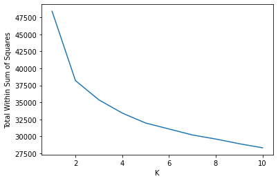
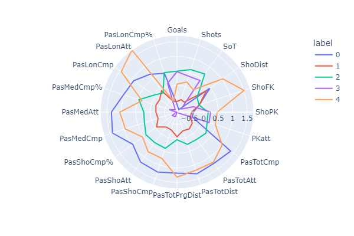
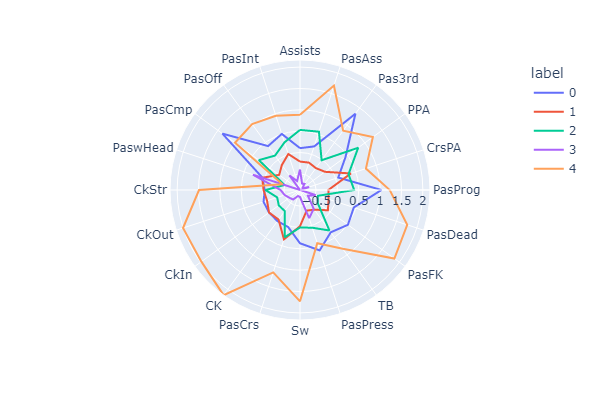
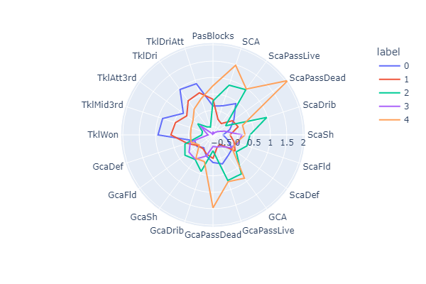
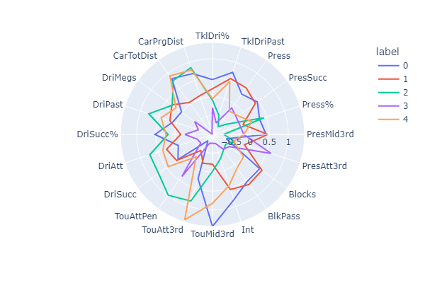
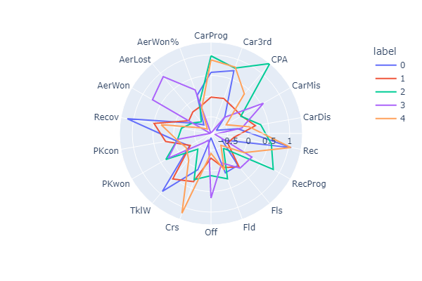
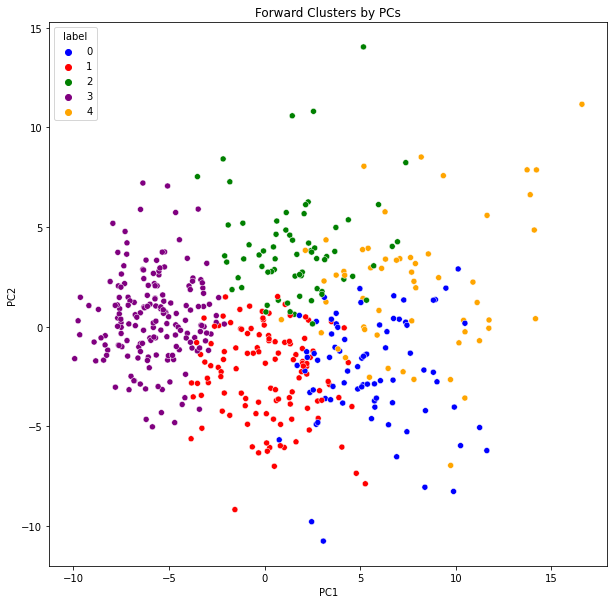

# Forward-Playing-Styles

This Python code examines event data in the 2021/22 season from the top 5 European soccer leagues (Premier League, La Liga, Ligue 1, Bundesliga, Seria A). The goal of this mini-project was to determine clusters of forwards (Wingers, Strikers, Center Forwards) in the top 5 leagues and to determine what specific play styles exist based on event data including shooting, passing, pressing, and dribbling statistics. Feel free to check out the full jupyter notebook file attached.

Methods used: 
* Principal Component Analysis
* K-means Clustering

# Summary of Results

### Screeplot

Based on the "elbow" of the screeplot plot produced, I chose to conduct k-means clustering with k = 5 clusters. I also moved forward with 5 clusters considering the variation within wingers and strikers play styles in soccer which can include traditional strikers, playmakers, target men, deep lying forwards, traditional wingers, inverted wingers etc.

### Player Statistics by cluster (radar plots)

Cluster summaries:

0: Group 0 appears to have very good passing stats, like group 4, with the best assist stats and most shot creating actions, high set piece stats such as corner kicks and free kicks, most touches in the final third, crosses, and high progressive dribbling stats. This appears to be generally the most creative cluster. Notable players: Lionel Messi, Neymar, Phil Foden, Paulo Dybala, Hakim Ziyech

1: Group 1 appears to have superior aerial, shooting, scoring, and pressing stats, comprising what appears to be a "target man" cluster. Notable players: Erling Haaland, Robert Lewandowski, Cristiano Ronaldo

2: Group 2 has fairly good passing stats, elite scoring / shooting stats, high shot and goal creating action stats, and the highest dribbling and carrying stats. This cluster appears to be a direct and creative like group 0 with a focus on dribbling as opposed to passing. Notable players: Karim Benzema, Harry Kane, Mohammed Salah, Kylian Mbappe

3: Group 3 is fairly average across most stat categories with better tackling, blocking, and pressing stats when compared to the other groups, comprising what may be a "pressing forward" cluster. Notable players: Antoine Griezmann, Christian Pulisic, Marcus Rashford

4: This group appears to have the best passing stats and tackling/pressing stats, with high passes attempted, completed, passing percentage, recoveries, tackles won among others when compared to the other 4 clusters. Notable players: Roberto Firmino, Bernardo Silva, Serge Gnabry

### Clusters displayed by principal component analysis

Analysis of Clusters based on PCA: It looks like there is a fairly even separation of clusters on PC1 compared to PC2, indicating passing ability, carries, and recoveries has influenced clustering about the same amount as goal scoring ability, as discussed above when analyzing the influential features in the two principal components.

Data set from https://www.kaggle.com/datasets/vivovinco/20212022-football-player-stats?resource=download
Data provided by https://fbref.com/en/comps/Big5/stats/players/Big-5-European-Leagues-Stats
